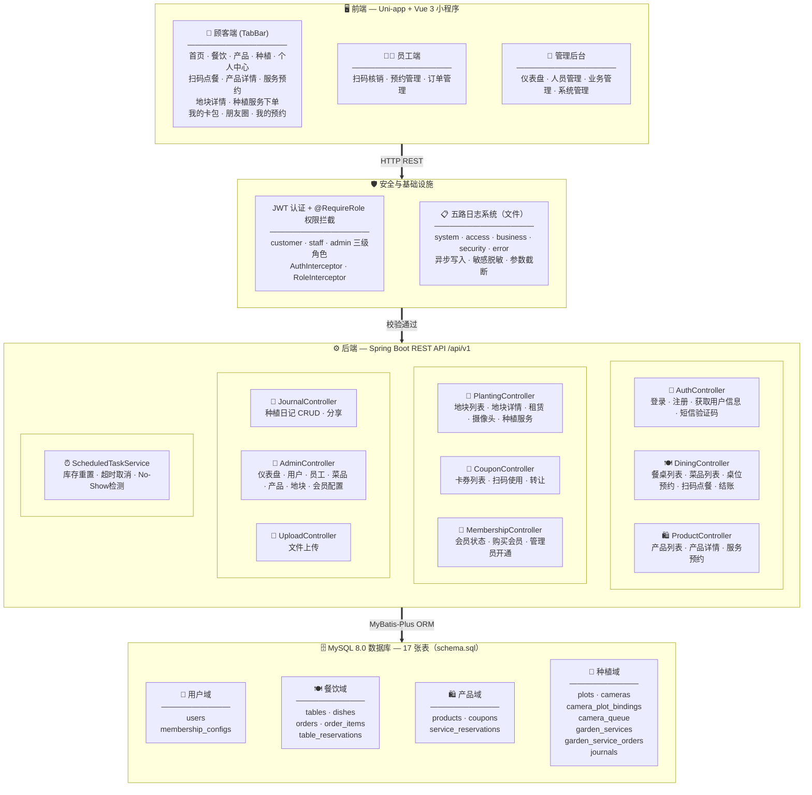

# 农家乐小程序

农家乐综合管理小程序 — 集餐饮点餐、产品购买、种植体验、会员管理于一体。

## 技术栈

| 层面 | 技术 |
|------|------|
| 前端 | Uni-app + Vue 3 + Pinia |
| 后端 | Spring Boot 3.2 + Java 21 + MyBatis-Plus |
| 数据库 | MySQL 8.0 |
| 认证 | JWT (JJWT) |
| 文件存储 | 服务器本地 |

## 环境要求

- JDK >= 21
- Maven >= 3.8
- Node.js >= 18.0.0
- MySQL >= 8.0
- 微信开发者工具（[下载地址](https://developers.weixin.qq.com/miniprogram/dev/devtools/download.html)）

## 快速启动

### 1. 数据库

```sql
CREATE DATABASE IF NOT EXISTS agritainment DEFAULT CHARACTER SET utf8mb4 COLLATE utf8mb4_unicode_ci;
```

应用启动时会自动执行 `schema.sql`（建表）和 `data.sql`（种子数据），无需手动导入。

如需手动初始化：

```powershell
mysql -u root -p agritainment < server/src/main/resources/schema.sql
mysql -u root -p agritainment < server/src/main/resources/data.sql
```

### 2. 后端

```powershell
cd server
$env:JAVA_HOME="G:\Java\jdk-21"   # 按实际 JDK 路径修改
mvn spring-boot:run
```

启动成功后访问 `http://localhost:8080`。

### 3. 前端

```powershell
cd client
npm install
npm run dev:mp-weixin
```

用微信开发者工具打开 `client/dist/dev/mp-weixin` 目录即可预览。

## 开发测试须知

### 测试账号

| 角色 | 手机号 | 密码 / 验证码 | 说明 |
|------|--------|---------------|------|
| 超级管理员 | 13800000001 | admin123 | 管理后台登录 |
| 副管理员 | 13800000002 | admin123 | 管理后台登录 |
| 员工 | 13800000010 | 123456 | 短信验证码登录 |
| 员工 | 13800000011 | 123456 | 短信验证码登录 |
| 会员顾客 | 13900000001 | 123456 | 短信验证码登录 |
| 普通顾客 | 13900000002 | 123456 | 短信验证码登录 |

### 开发模式特性

- **短信验证码**：开发环境下固定为 `123456`，无需真实发送短信（配置项 `app.sms.dev-code`）
- **微信登录**：未配置真实 appid/secret 时，微信登录接口会跳过 `code2Session`，不会真正调用微信服务器，小程序端需手动通过短信验证码登录
- **CORS**：开发环境允许所有来源（`app.cors.allowed-origins: "*"`）
- **数据库初始化**：每次启动自动执行 `schema.sql` + `data.sql`（`spring.sql.init.mode: always`）

### API 地址

- 后端 API 基地址：`http://localhost:8080/api/v1`
- 前端配置文件：`client/src/api/request.js` 中的 `BASE_URL`

### 种子数据概览

| 数据 | 数量 | 说明 |
|------|------|------|
| 餐桌 | 10 张 | A1-A3(4人)、B1-B2(8人)、C1-C2(10/12人)、D1-D2(6/4人)、VIP1(10人) |
| 菜品 | 10 道 | 农家土鸡、红烧肉、清蒸鲈鱼等 |
| 产品 | 6 个 | 采摘体验券、钓鱼体验券、土鸡蛋、腊肉、水果礼盒、BBQ套餐 |
| 地块 | 8 块 | 春晓园/夏荫园/秋实园/冬暖园各2块 |
| 摄像头 | 4 个 | CAM-001~004，CAM-003 为离线状态 |
| 种植服务 | 6 项 | 浇水、施肥、除草、病虫害防治、采收、全托管 |
| 会员配置 | 1 条 | 年费199元，85折，赠送采摘+钓鱼体验 |

## 功能结构图



> 各层自上而下串联，层内模块横向排列。CLIENT → SECURITY → SERVER → DATABASE。

## 项目结构

```
Agritainment/
├── client/                  # 前端 (Uni-app)
│   └── src/
│       ├── api/             # API 请求封装
│       ├── components/      # 公共组件
│       ├── pages/           # 页面
│       │   ├── index/       # 首页
│       │   ├── dining/      # 餐饮（点餐、预约）
│       │   ├── products/    # 产品服务
│       │   ├── planting/    # 种植体验
│       │   ├── profile/     # 个人中心
│       │   ├── staff/       # 员工端
│       │   ├── admin/       # 管理后台
│       │   └── login/       # 登录
│       ├── stores/          # Pinia 状态
│       └── utils/           # 工具函数
├── server/                  # 后端 (Spring Boot)
│   └── src/main/
│       ├── java/.../
│       │   ├── controller/  # 控制器（9 个）
│       │   ├── service/     # 业务逻辑（12 个）
│       │   ├── mapper/      # MyBatis-Plus 数据访问（17 个）
│       │   ├── entity/      # 实体类（17 个）
│       │   ├── dto/         # 请求/响应对象
│       │   ├── interceptor/ # 拦截器（AuthInterceptor · RoleInterceptor · LoggingInterceptor）
│       │   ├── logging/     # AOP日志切面（BusinessLogAspect）
│       │   ├── annotation/  # 自定义注解（@RequireRole · @BusinessLog）
│       │   ├── enums/       # 枚举（RoleEnum 等）
│       │   ├── common/      # 通用工具（Result · AppException · IpUtils · SensitiveDataUtils）
│       │   ├── util/        # 工具类（JwtUtil）
│       │   └── config/      # 配置类（WebConfig · MyBatisPlusConfig · 日志配置）
│       └── resources/
│           ├── application.yml
│           ├── application-prod.yml
│           ├── schema.sql    # 17 张表 DDL
│           ├── data.sql      # 种子数据
│           └── logback-spring.xml  # 五路日志配置
└── specs/                   # 规格文档
```

## 配置微信小程序（上线前）

编辑 `server/src/main/resources/application.yml`：

```yaml
app:
  wechat:
    mini-program:
      appid: ${WECHAT_APPID:你的AppID}
      secret: ${WECHAT_SECRET:你的AppSecret}
```

或通过环境变量设置：

```powershell
$env:WECHAT_APPID="wx1234567890"
$env:WECHAT_SECRET="your-secret-here"
mvn spring-boot:run
```

## 常用命令

```powershell
# 后端测试
cd server; mvn test

# 前端编译检查
cd client; npx vite build

# 前端 H5 预览（无需微信开发者工具）
cd client; npm run dev:h5
```

## 日志系统

日志写入 `server/logs/` 目录，启动后自动生成。所有日志通过 `requestId` 串联同一请求的完整链路。

### 日志文件

| 文件 | 级别 | 保留 | 说明 |
|------|------|------|------|
| **system.log** | INFO+ | 30天 | 系统综合日志（框架、SQL、定时任务） |
| **access.log** | INFO+ | 30天 | HTTP 请求访问日志（方法、路径、状态码、耗时），慢请求(>3s)标记 |
| **business.log** | INFO+ | 30天 | 业务写操作日志（创建/修改/删除等），自动脱敏手机号/openid/密码 |
| **security.log** | INFO+ | 30天 | 安全审计日志（认证失败、权限不足、黑名单拦截） |
| **error.log** | WARN+ | 90天 | 集中错误日志，收集所有 WARN 及以上级别 |

### 日志格式

```
2026-05-09 18:23:08.410 [线程名] [req:requestId][user:userId] 级别 Logger名 - 消息体
```

### 开发 vs 生产

| 环境 | 控制台 | 文件 | 日志级别 |
|------|--------|------|----------|
| 开发（default profile） | ✅ 输出 | ✅ 写入 | DEBUG（com.agritainment）/ INFO（根） |
| 生产（prod profile） | ❌ 不输出 | ✅ 写入 | INFO（com.agritainment）/ WARN（根） |

### 关键特性

- **异步写入**：所有文件通过 `AsyncAppender` 写入，不阻塞业务线程
- **安全零丢失**：安全/错误日志 `discardingThreshold=0`，队列满时阻塞等待而非丢弃
- **敏感数据脱敏**：手机号前3后4、openid/身份码部分隐藏、密码/验证码完全替换为 `******`
- **参数截断**：单个日志参数超过 500 字符自动截断，防止日志膨胀
