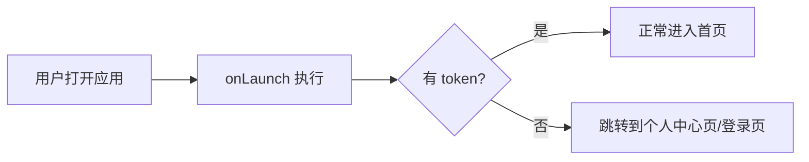

# 前端页面加载流程

> 以本项目的 uni-app (Vue 3 + Pinia + Vite) 架构为例，讲解前端页面从入口到渲染的完整加载流程。

---

## 全景图

```
index.html  →  main.js  →  App.vue  →  页面组件  →  数据请求  →  渲染显示
   (入口)       (启动)      (根组件)     (路由页)     (API)      (UI)
```

---

## 第一步：`index.html` — 浏览器入口

```html
<!-- client/index.html -->
<!DOCTYPE html>
<html lang="zh-CN">
  <head>
    <meta charset="UTF-8" />
    <meta name="viewport" content="width=device-width, initial-scale=1.0" />
    <title>农家乐</title>
  </head>
  <body>
    <div id="app"><!--app-html--></div>
    <script type="module" src="/src/main.js"></script>
  </body>
</html>
```

- `<script type="module" src="/src/main.js">` 是整个应用的**点火开关**，浏览器看到它就会加载并执行 `main.js`
- `type="module"` 支持 ES6 `import`/`export`，浏览器会**自动递归加载所有依赖**（vue、pinia 等）
- `<div id="app">` 是 Vue 的挂载点占位符

---

## 第二步：`main.js` — 创建 Vue 应用

```js
// client/src/main.js
import { createSSRApp } from 'vue'
import { createPinia } from 'pinia'
import App from './App.vue'

export function createApp() {
  const app = createSSRApp(App)     // 创建 Vue 应用实例，指定 App.vue 为根组件
  const pinia = createPinia()        // 创建全局状态管理仓库
  app.use(pinia)                     // 挂载 Pinia 到 Vue
  return { app }
}
```

| 操作 | 含义 |
|---|---|
| `createSSRApp(App)` | 告诉 Vue："App.vue 是根组件，所有页面都在它下面" |
| `createPinia()` | 创建全局状态仓库，之后任何组件都可以用 `useAuthStore()` 等 |
| `app.use(pinia)` | 把 Pinia 注册到 Vue 插件系统 |

> `createSSRApp` 是 uni-app 的做法，让同一份代码同时支持 H5 和小程序。对理解加载流程，可以简单理解为"创建 Vue 应用"。

---

## 第三步：`App.vue` — 根组件生命周期

```vue
<!-- client/src/App.vue -->
<script>
import { useAuthStore } from '@/stores/auth'

export default {
  onLaunch() {
    const store = useAuthStore()
    if (!store.isLoggedIn) {
      uni.switchTab({ url: '/pages/profile/index' })
    }
  },
  onShow() {},
  onHide() {}
}
</script>
```

### 应用级生命周期钩子

| 钩子 | 触发时机 | 典型用途 |
|---|---|---|
| `onLaunch` | 应用第一次启动，**只调用一次** | 检查登录状态、获取系统信息、全局初始化 |
| `onShow` | 应用从后台切到前台显示 | 刷新数据、检查 token 过期 |
| `onHide` | 应用切到后台（锁屏、切微信） | 暂停任务、保存临时状态 |

### 登录守卫流程



---

## 第四步：页面组件加载

每个页面的 Vue 组件都有自己独立的生命周期：

```vue
<!-- client/src/pages/index/index.vue -->
<script>
export default {
  data() {                         // 1. 初始化响应式数据
    return { journals: [] }
  },
  onShow() {                       // 2. 页面显示时触发
    if (!store.isLoggedIn) {
      uni.switchTab({ url: '/pages/profile/index' })
      return
    }
    this.loadJournals()            // 3. 加载数据
  },
  methods: {
    async loadJournals() {         // 4. 发起 API 请求
      this.journals = await journalApi.getSharedJournals()
    }
  }
}
</script>
```

### 应用级 vs 页面级生命周期

| 应用级 (App.vue) | 页面级 (每个 page) | 触发时机 |
|---|---|---|
| `onLaunch` | — | 应用冷启动 |
| `onShow` | `onShow` | 应用/页面出现在屏幕上 |
| `onHide` | `onHide` | 应用/页面被隐藏 |

**Tab 切换场景示例**：用户从"首页"切换到"餐饮" tab：
1. 首页的 `onHide` 执行
2. 餐饮页的 `onShow` 执行
3. `App.vue` 的 `onShow` **不会**执行（应用没有切到后台）

---

## 第五步：数据加载 — API 调用链

以 `journalApi.getSharedJournals()` 为例：

```
页面组件                API 层                  网络               后端
   │                     │                      │                  │
   │ loadJournals()      │                      │                  │
   │────────────────────→│                      │                  │
   │                     │ GET /journals/shared  │                  │
   │                     │─────────────────────→│                  │
   │                     │                      │ ────────────────→│
   │                     │                      │                  │ 查询数据库
   │                     │                      │ ←────────────────│
   │                     │ ←────────────────────│                  │
   │   返回 JSON 数据    │                      │                  │
   │←────────────────────│                      │                  │
   │                     │                      │                  │
   │ this.journals = data          ← 赋值触发响应式更新            │
   │                     │                      │                  │
   │ 模板重新渲染        │                      │                  │
```

### 代码对应关系

```js
// 页面调用
this.journals = await journalApi.getSharedJournals()

// ↓ api/index.js 中的定义
getSharedJournals: () => get('/journals/shared')

// ↓ api/request.js 底层封装
// ↓ 实际发起 HTTP GET → http://localhost:8080/api/journals/shared
// ↓ Vite 代理将 /api 转发到后端 8080 端口（见 vite.config.js）
```

### API 代理配置

```js
// client/vite.config.js
server: {
  proxy: {
    '/api': {
      target: 'http://localhost:8080',
      changeOrigin: true
    }
  }
}
```

开发时前端请求 `/api/xxx` 会被 Vite 自动转发到 `http://localhost:8080/xxx`，避免跨域问题。

---

## 第六步：响应式渲染

Vue 的核心能力。当执行 `this.journals = data` 时：

1. Vue 检测到 `journals` 变化（`data()` 中声明的变量都是**响应式**的）
2. Vue 自动重新渲染模板中用到 `journals` 的部分
3. 页面从"暂无动态"变为显示动态列表

```vue
<template>
  <!-- journals 变化 → v-if 重新判断 -->
  <view class="journal-list" v-if="journals.length">
    <view class="journal-card" v-for="item in journals" :key="item.id">
      <!-- 循环渲染每条动态 -->
    </view>
  </view>
  <!-- 没数据时显示空状态 -->
  <view v-else class="empty">
    <text class="empty-text">暂无动态</text>
  </view>
</template>
```

---

## 完整时序示例

**用户打开小程序 → 登录 → 进入首页：**

```
1. index.html 加载
   └─→ 浏览器加载 main.js

2. main.js 执行
   └─→ 创建 Vue 应用 (createSSRApp)
   └─→ 安装 Pinia 状态管理
   └─→ 挂载 App.vue 作为根组件

3. App.vue onLaunch 触发
   └─→ useAuthStore() 读取本地存储的 token
   └─→ token 为空 → uni.switchTab 跳到个人中心页

4. 登录页显示
   └─→ 用户输入手机号 + 验证码
   └─→ authApi.login() → POST /api/auth/login
   └─→ 后端返回 token → 存入 Pinia state + uni.setStorageSync
   └─→ fetchUserInfo() → GET /api/auth/me 获取用户信息
   └─→ navigateToRoleHome() → uni.switchTab 跳转到首页

5. 首页 onShow 触发
   └─→ 检查登录状态（通过）
   └─→ loadJournals() → GET /api/journals/shared
   └─→ 数据返回 → this.journals = data
   └─→ Vue 响应式系统自动更新模板 → 页面渲染完成
```

---

## 关键概念速查

| 概念 | 解释 | 本项目体现 |
|---|---|---|
| **SPA（单页应用）** | 只有一个 HTML，页面切换本质是组件的切换，不会重新加载整个文档 | 从首页切换到餐饮 tab 只替换组件，`index.html` 不变 |
| **响应式数据** | 数据变化时视图自动更新 | `this.journals = data` 后模板自动刷新 |
| **状态管理 (Pinia)** | 跨组件共享的全局数据仓库 | `useAuthStore()` 的 token 和 userInfo 被所有页面访问 |
| **生命周期钩子** | 在特定阶段自动调用的函数 | `onLaunch`（启动时）、`onShow`（显示时） |
| **API 代理** | 开发时前端请求自动转发到后端 | `/api/xxx` → Vite 代理 → `localhost:8080/xxx` |
| **Token 持久化** | 将登录凭证存储到本地，下次启动时读取 | `uni.setStorageSync('token', ...)` / `uni.getStorageSync('token')` |

---

## 项目文件索引

| 文件 | 作用 |
|---|---|
| [client/index.html](file:///e:/Workspace/AI/Agritainment/client/index.html) | 浏览器入口 HTML |
| [client/src/main.js](file:///e:/Workspace/AI/Agritainment/client/src/main.js) | Vue 应用创建入口 |
| [client/src/App.vue](file:///e:/Workspace/AI/Agritainment/client/src/App.vue) | 根组件，应用级生命周期 |
| [client/src/stores/auth.js](file:///e:/Workspace/AI/Agritainment/client/src/stores/auth.js) | 认证状态管理 |
| [client/src/api/index.js](file:///e:/Workspace/AI/Agritainment/client/src/api/index.js) | API 接口定义 |
| [client/src/api/request.js](file:///e:/Workspace/AI/Agritainment/client/src/api/request.js) | HTTP 请求底层封装 |
| [client/src/pages/index/index.vue](file:///e:/Workspace/AI/Agritainment/client/src/pages/index/index.vue) | 首页组件 |
| [client/src/pages/profile/index.vue](file:///e:/Workspace/AI/Agritainment/client/src/pages/profile/index.vue) | 个人中心组件 |
| [client/vite.config.js](file:///e:/Workspace/AI/Agritainment/client/vite.config.js) | Vite 构建配置（含 API 代理） |